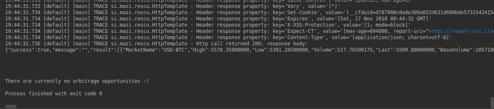

# Java-Bitcoin-Arbitrager

## Description
This is a terminal application that checks the conversion rate of USD to BTC at various cryptocurrency exchanges and searches them for arbitrage opportunities. It will display opportunities found in a text table showing you who to buy from, who to sell to, and how much profit can be made. This application currently arbitrages four exchanges. Their names are [Bitstamp](https://www.bitstamp.net/), [Kraken](https://www.kraken.com/), [Bitmex](https://www.bitmex.com/), and  [Bittrex](https://bittrex.com/).

For the uninitiated, arbitrage is when two markets are selling the same good at the different prices. That means that someone could essentially buy the good from the cheaper market and sell it at the more expensive market for a risk free profit. This command line application is essentially doing this with the various Bitcoin currency exchanges on the internet.

Note that Bitcoin trading is still inherently risky. This application does not eliminate that risk. Please use with caution!

## Requirements
1. [Maven](https://maven.apache.org/)
2. Internet access

## Installation

1. Clone the project into your desired directory.

2. Download the dependencies with Maven.

3. The project is ready to run!

## Usage

### Checking for Arbitrage Opportunities
 Run the project by executing the main method in **Application class** in `src/main/java/main/` to start the application.

 Depending on the state of the Bitcoin exchanges you will see two outputs.

 This is displayed when there are no opportunities.

 

 This is displayed when there are existing opportunities.

 

 The text above the output message in each screenshot is information regarding how each bitcoin exchange was contacted for data. Also, note that are lists are shown as USD to BTC.
